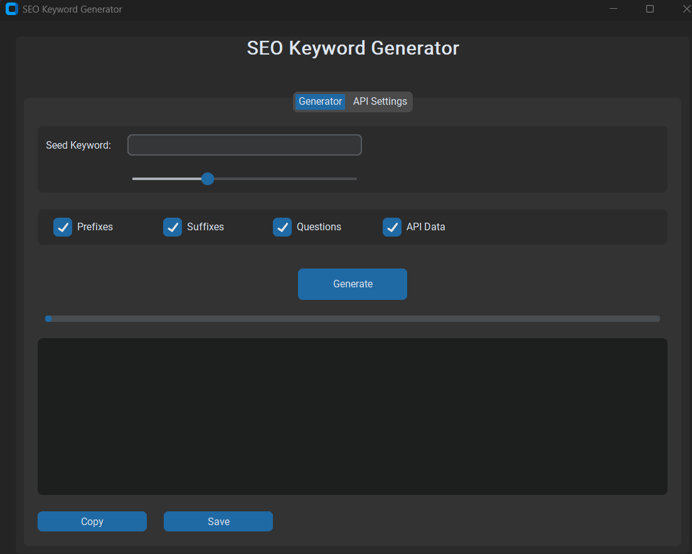
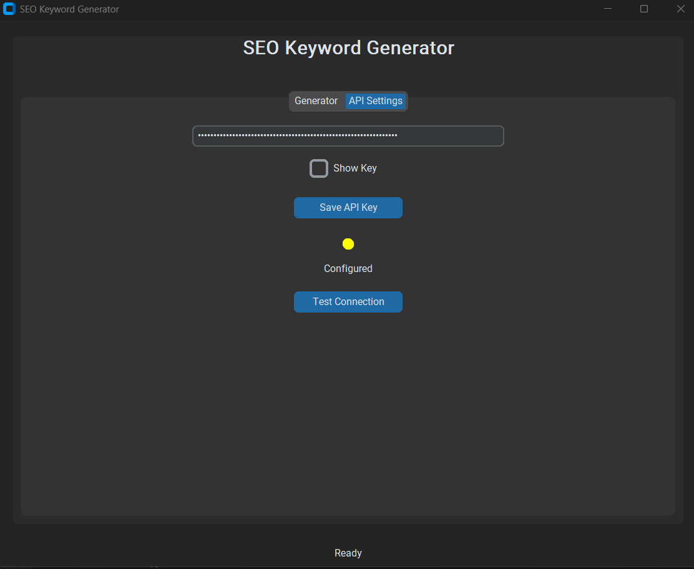
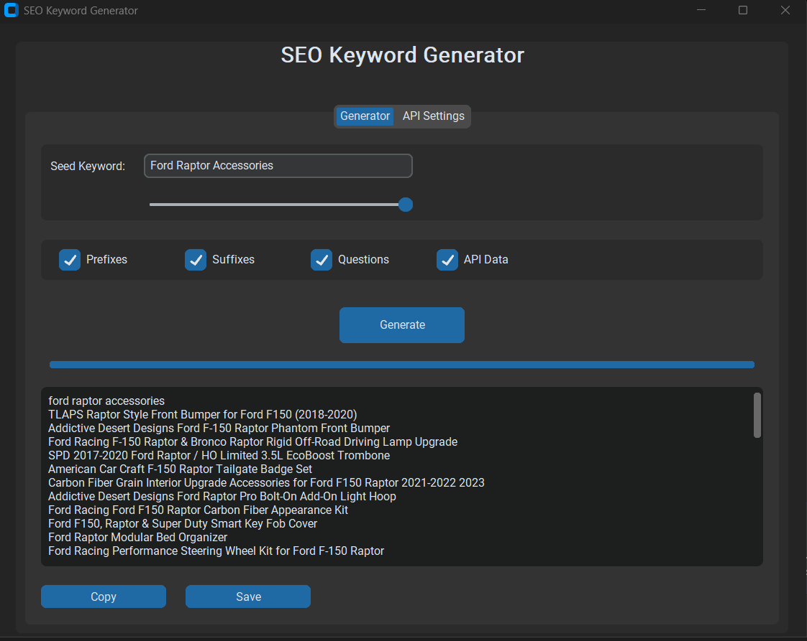
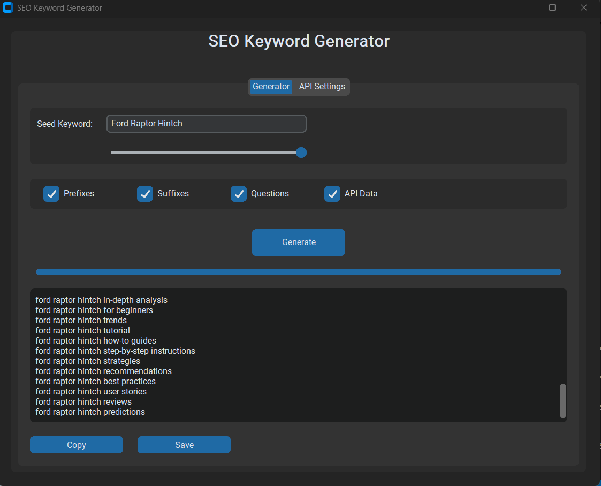

# SEO Keyword Generator 🔍✨

## Overview

The SEO Keyword Generator is a powerful desktop application built with Python that helps digital marketers, content creators, and SEO professionals generate a wide variety of keyword ideas quickly and efficiently.

## Features

### Keyword Generation
- Generate keywords based on a seed keyword
- Customize keyword generation with multiple options:
  - Add prefixes
  - Add suffixes
  - Include question-based keywords
  - Integrate API data sources

### Data Sources
- Google Trends integration
- SerpAPI support for additional keyword insights
- Mock data generation when API keys are not available

### User-Friendly Interface
- Built with CustomTkinter for a modern, clean UI
- Intuitive controls and settings
- Real-time keyword generation
- Keyword count slider
- Progress tracking

## Prerequisites

### Dependencies
- Python 3.8+
- Libraries:
  - customtkinter
  - pytrends
  - requests
  - tkinter

### Optional
- SerpAPI key for enhanced keyword research

## Installation

1. Clone the repository
```bash
git clone https://github.com/yourusername/seo-keyword-generator.git
cd seo-keyword-generator
```

2. Install required dependencies
```bash
pip install customtkinter pytrends requests
```

## Usage

1. Launch the application
2. Enter a seed keyword
3. Adjust generation settings
4. Click "Generate"
5. Copy or save generated keywords

### API Configuration
- Navigate to the "API Settings" tab
- Enter your SerpAPI key (optional)
- Test connection to validate API access

## Screenshots

### Main Generator Tab


### API Settings


### Keyword Results



## Contributing

1. Fork the repository
2. Create your feature branch
3. Commit your changes
4. Push to the branch
5. Create a pull request

## License

MIT License

Copyright (c) 2025 Mark Lumba

Permission is hereby granted, free of charge, to any person obtaining a copy
of this software and associated documentation files (the "Software"), to deal
in the Software without restriction, including without limitation the rights
to use, copy, modify, merge, publish, distribute, sublicense, and/or sell
copies of the Software, and to permit persons to whom the Software is
furnished to do so, subject to the following conditions:

The above copyright notice and this permission notice shall be included in all
copies or substantial portions of the Software.

THE SOFTWARE IS PROVIDED "AS IS", WITHOUT WARRANTY OF ANY KIND, EXPRESS OR
IMPLIED, INCLUDING BUT NOT LIMITED TO THE WARRANTIES OF MERCHANTABILITY,
FITNESS FOR A PARTICULAR PURPOSE AND NONINFRINGEMENT. IN NO EVENT SHALL THE
AUTHORS OR COPYRIGHT HOLDERS BE LIABLE FOR ANY CLAIM, DAMAGES OR OTHER
LIABILITY, WHETHER IN AN ACTION OF CONTRACT, TORT OR OTHERWISE, ARISING FROM,
OUT OF OR IN CONNECTION WITH THE SOFTWARE OR THE USE OR OTHER DEALINGS IN THE
SOFTWARE.

## Disclaimer

This tool is designed to assist in keyword research. Always validate and refine keywords based on your specific SEO strategy.


